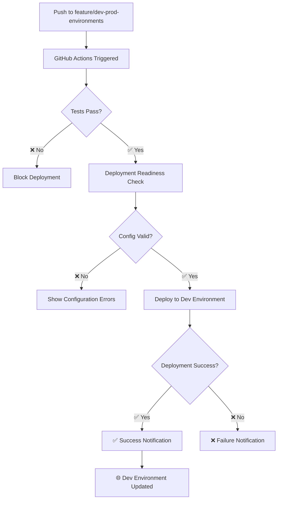

# 🚀 Automated Deployment Setup Guide

This guide helps configure **Phase 2 Week 5: Automated Dev Deployment** for the Bitrix24 Quotation Generator.

## 🎯 Overview

After tests pass on the `feature/dev-prod-environments` branch, the system will automatically:
- ✅ Deploy to development environment (`bx-app-quotation-generator-dev`)
- ✅ Provide deployment status notifications
- ⚠️ Keep production deployment manual for safety

## 🔧 Required GitHub Secrets

### 1. Cloudflare API Configuration

Go to **GitHub Repository → Settings → Secrets and variables → Actions**

Add these repository secrets:

```
CLOUDFLARE_API_TOKEN
CLOUDFLARE_ACCOUNT_ID
```

### 2. Getting Your Cloudflare Credentials

#### API Token (Recommended):
1. Go to https://dash.cloudflare.com/profile/api-tokens
2. Click **"Create Token"**
3. Use **"Custom token"** template
4. **Token name**: `GitHub Actions Deploy`
5. **Permissions**:
   - `Account:Cloudflare Workers:Edit`
   - `Zone:Zone Settings:Read` 
   - `Zone:Zone:Read`
6. **Account resources**: `Include - All accounts`
7. **Zone resources**: `Include - All zones`
8. Copy the generated token → Add as `CLOUDFLARE_API_TOKEN`

#### Account ID:
1. Go to https://dash.cloudflare.com/
2. Select your account
3. Copy **Account ID** from the right sidebar
4. Add as `CLOUDFLARE_ACCOUNT_ID`

### 3. Environment Protection (Optional)

For additional safety, configure environment protection:

1. Go to **Settings → Environments**  
2. Click **"New environment"**
3. Name: `development`
4. **Protection rules**:
   - ✅ **Required reviewers**: 0 (optional - add team members)
   - ✅ **Wait timer**: 0 minutes
   - ✅ **Deployment branches**: Selected branches only
     - Add rule: `feature/dev-prod-environments`

## 🧪 Testing the Setup

### 1. Verify Secrets Are Configured

Check that these secrets exist in your repository:
- ✅ `CLOUDFLARE_API_TOKEN` 
- ✅ `CLOUDFLARE_ACCOUNT_ID`

### 2. Test Deployment Manually (First Time)

Before relying on automation, test manually:

```bash
# Local test deployment
npm run deploy:dev

# Should output:
# ✅ Successfully deployed to development environment
# 🌐 URL: https://bx-app-quotation-generator-dev.{account}.workers.dev
```

### 3. Trigger Automated Deployment

Make a small change and push to the feature branch:

```bash
git checkout feature/dev-prod-environments
echo "# Auto-deployment test" >> README.md
git add README.md
git commit -m "test: trigger automated dev deployment"
git push origin feature/dev-prod-environments
```

### 4. Monitor GitHub Actions

1. Go to **Actions** tab in your GitHub repository
2. Watch the **🚀 Continuous Integration** workflow
3. Verify these jobs complete successfully:
   - ✅ **Essential Tests (Required)**
   - ✅ **Deployment Readiness**  
   - 🚀 **Deploy to Development**

## 📊 Deployment Flow Diagram



## 🔍 Troubleshooting

### Common Issues

#### 1. **Error: "Missing CLOUDFLARE_API_TOKEN"**
```
Solution: Add the API token to GitHub repository secrets
Path: Settings → Secrets and variables → Actions → New repository secret
```

#### 2. **Error: "Workers KV namespace not found"**
```
Cause: KV namespace IDs in wrangler.toml don't match your account
Solution: Run `npx wrangler kv:namespace create BITRIX_KV --env dev` and update wrangler.toml
```

#### 3. **Error: "Account ID mismatch"**
```
Cause: Wrong CLOUDFLARE_ACCOUNT_ID in secrets  
Solution: Copy the correct Account ID from Cloudflare dashboard
```

#### 4. **Deployment succeeds but app doesn't work**
```
Common causes:
- KV namespace bindings incorrect
- Environment variables missing
- Compatibility date issues

Debug: Check Worker logs with `npx wrangler tail --env dev`
```

### Debug Commands

```bash
# Check Wrangler authentication (locally)
npx wrangler whoami

# Test dev deployment (locally)
npm run deploy:dev

# Monitor dev environment logs
npm run tail:dev

# Validate wrangler configuration
npx wrangler deploy --env dev --dry-run
```

## 🎯 Success Criteria

After setup completion, you should see:

- ✅ **Automated Testing**: Tests run on every push
- ✅ **Automatic Deployment**: Dev environment updates after tests pass  
- ✅ **Status Notifications**: Clear success/failure messages
- ✅ **Safe Production**: Production still requires manual deployment
- ✅ **Easy Rollback**: Can revert deployments using git

## 🚀 Next Steps

Once automated dev deployment is working:

1. **Monitor for 1-2 weeks** - Ensure reliability
2. **Gather team feedback** - Adjust workflow if needed  
3. **Phase 3**: Begin structured logging implementation
4. **Future**: Consider staging environment for production-like testing

## ⚠️ Important Notes

- **Production Safety**: Production deployment remains manual (`npm run deploy:prod`)
- **Branch Specific**: Only `feature/dev-prod-environments` triggers auto-deployment
- **Test Dependency**: Deployment only happens if all tests pass
- **Rollback Strategy**: Use `git revert` to rollback changes automatically

---

*This setup implements the incremental deployment philosophy: small steps, easy debugging, no big bang changes.*