# 🤖 GitHub Actions Workflows

This directory contains automated workflows for the Bitrix24 Quotation Generator project, implementing **Phase 2: CI/CD Pipeline** of the deployment roadmap.

## 📋 Workflow Overview

### 🚀 `ci.yml` - Main CI Pipeline  
**Purpose**: Essential automated checks for branch protection  
**Triggers**: Push to `feature/dev-prod-environments`, PRs to main branches  

**Jobs**:
- ✅ **Essential Tests** (Required) - All 35+ unit & integration tests  
- 📊 **Code Quality** (Optional) - Formatting, linting, security audit
- 🚀 **Deployment Readiness** - Validates configuration for auto-deployment

### 🧪 `test.yml` - Comprehensive Testing
**Purpose**: Multi-environment testing matrix  
**Triggers**: Push/PR to main branches  

**Features**:
- Node.js 18 & 20 compatibility testing
- Code coverage reporting  
- Security vulnerability scanning
- Build validation with Wrangler

## 🔒 Branch Protection Strategy

### Required Checks (Blocking)
- ✅ `Essential Tests (Required)` - Must pass for merge
- All 35+ tests (24 unit + 7 integration + 4 smoke tests)

### Optional Checks (Informational)
- 📊 Code Quality - Format & lint warnings
- 🔒 Security Audit - Vulnerability reporting  
- 🏗️ Build Validation - Wrangler dry-run

## 🚀 Deployment Flow (Phase 2 Week 5)

```mermaid
graph LR
    A[Push Code] --> B[Tests Run]
    B --> C{Tests Pass?}
    C -->|✅ Yes| D[Auto-Deploy Dev]
    C -->|❌ No| E[Block Merge]
    D --> F[Manual Prod Deploy]
```



## 🛠️ Development Workflow

```bash
# 1. Make changes locally
git checkout feature/dev-prod-environments
git add . && git commit -m "feat: your changes"

# 2. Push triggers GitHub Actions  
git push origin feature/dev-prod-environments

# 3. Check workflow status
# Visit: https://github.com/{owner}/{repo}/actions

# 4. On success, changes ready for deployment
npm run deploy:dev  # (Will be automated in Week 5)
```

## 📊 Monitoring & Debugging

### Workflow Status
- Green ✅: All checks passed, ready to merge
- Red ❌: Tests failed, fix required before merge  
- Yellow ⚠️: Optional checks failed, informational only

### Common Issues
1. **Test Failures**: Run `npm test` locally to debug
2. **Build Issues**: Check `wrangler.toml` configuration
3. **Coverage Issues**: Normal with Cloudflare Workers, non-blocking

### Rollback Strategy  
```bash
# If workflow causes issues, rollback:
git revert HEAD~1  # Revert last commit
git push origin feature/dev-prod-environments
```

## 🎯 Success Metrics (Phase 2)

- ✅ **Zero Manual Test Runs**: All testing automated
- ✅ **Fast Feedback**: Results within 3-5 minutes  
- ✅ **Branch Protection**: No broken code reaches main
- ✅ **Deployment Ready**: Prepared for auto-deployment in Week 5

---

*This documentation follows the incremental deployment strategy: small steps, easy debug, avoid big bang changes.*