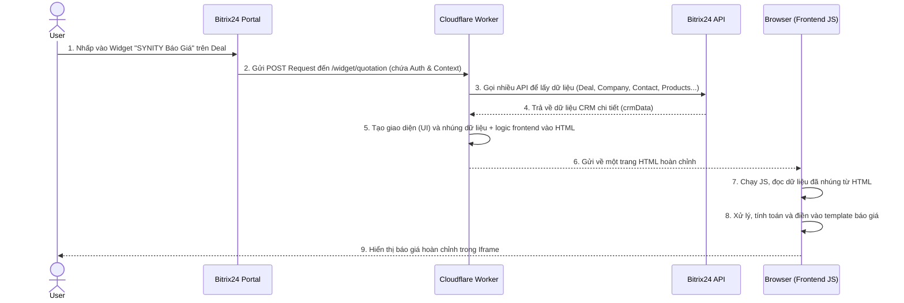

# Phân Tích Kiến Trúc & Đề Xuất Cải Tiến

  ## Phân Tích Tổng Quan

  Đây là một ứng dụng Bitrix24 được xây dựng theo kiến trúc serverless trên nền tảng Cloudflare Workers. Thay vì một ứng dụng truyền thống có backend và frontend riêng biệt, ở đây Worker đóng vai trò là một backend linh hoạt, có nhiệm vụ:
   1. Lắng nghe các sự kiện từ Bitrix24 (cài đặt, gỡ cài đặt, người dùng bấm vào widget).
   2. Giao tiếp với Bitrix24 REST API để lấy dữ liệu theo ngữ cảnh.
   3. Tạo động (dynamically generate) một ứng dụng frontend hoàn chỉnh (HTML, CSS, và JavaScript) và gửi nó về cho trình duyệt của người dùng để thực thi.

  ## Các Thành Phần Chính

  Mỗi tệp trong thư mục src/bitrix/ đóng một vai trò chuyên biệt:

   - `handlers.js` (Bộ Điều Phối - The Orchestrator): Đây là bộ não của backend. Nó nhận yêu cầu từ router (`index.js`), xác định cần làm gì, và điều phối các thành phần khác. `widgetQuotationHandler` là hàm quan trọng nhất ở đây.
   - `client.js` (Trình Khách API - The API Client): Một lớp (class) mạnh mẽ để giao tiếp với Bitrix24 REST API. Nó xử lý việc xác thực, tự động làm mới token, giới hạn tần suất gọi API (rate limiting), và xử lý lỗi.
   - `ui.js` (Trình Tạo Giao Diện - The UI Builder): Chịu trách nhiệm tạo ra phần vỏ HTML và CSS của ứng dụng mà người dùng nhìn thấy (sidebar, các nút bấm, khung xem trước). Nó nhúng logic và template từ các file khác vào.
   - `quotation-logic.js` (Logic Frontend - The Frontend Logic): Chứa toàn bộ mã JavaScript sẽ được thực thi trên trình duyệt của người dùng. Nó xử lý các tương tác, tính toán, và điền dữ liệu vào báo giá.
   - `quotation-template.js` (Template Báo Giá - The Document Template): Chứa cấu trúc HTML cho tài liệu báo giá cuối cùng. Đây là một template tĩnh với các biến giữ chỗ.
   - `storage.js`, `errors.js`, `rateLimiter.js`: Các module phụ trợ, cung cấp các chức năng về lưu trữ, xử lý lỗi, và giới hạn tần suất cho `client.js`.
   - `b24ui-template.js`: Một template giao diện khác, dùng cho trang chính của ứng dụng, không phải widget báo giá.
   - `direct-template-generator.js`: Một module thử nghiệm hoặc một cách tiếp cận khác, tạo ra HTML báo giá trực tiếp từ dữ liệu CRM mà không cần xử lý phía client. Tuy nhiên, nó không được sử dụng trong luồng hoạt động chính của widget.

  ---

  ## Luồng Dữ Liệu (Dataflow) Chi Tiết

  Đây là cách dữ liệu di chuyển từng bước khi người dùng bấm vào widget tạo báo giá trong một Deal:

  ### Giai đoạn 1: Yêu Cầu từ Bitrix24 đến Worker

   1. Hành Động: Người dùng nhấp vào tab "SYNITY Báo Giá" trên trang chi tiết của một Deal.
   2. Yêu Cầu (Request): Bitrix24 gửi một yêu cầu POST đến endpoint /widget/quotation của Cloudflare Worker. Yêu cầu này chứa:
       * AUTH_ID: Mã xác thực tạm thời.
       * DOMAIN: Tên miền portal Bitrix24.
       * PLACEMENT_OPTIONS: Một chuỗi JSON chứa ID của Deal mà người dùng đang xem.

  ### Giai đoạn 2: Worker Xử Lý và Lấy Dữ Liệu

   3. Điều Phối (`handlers.js`): `widgetQuotationHandler` nhận yêu cầu. Nó phân tích cú pháp để lấy auth_id, domain, và entityId (ID của Deal).
   4. Khởi Tạo Client (`client.js`): Handler tạo một thực thể (instance) của Bitrix24Client với thông tin xác thực vừa nhận được.
   5. Lấy Dữ Liệu CRM (`handlers.js` -> `client.js` -> Bitrix24 API):
       * Handler gọi hàm fetchCRMEntityData.
       * Hàm này sử dụng client.call() để thực hiện một loạt các lệnh gọi API ngược lại Bitrix24 nhằm thu thập một bộ dữ liệu hoàn chỉnh:
           * crm.deal.get({id: entityId}) -> Lấy thông tin Deal.
           * crm.company.get(...) -> Lấy thông tin công ty.
           * crm.contact.get(...) -> Lấy thông tin người liên hệ.
           * user.get(...) -> Lấy thông tin nhân viên phụ trách.
           * crm.item.productrow.list(...) -> Lấy danh sách sản phẩm trong Deal.
       * Tất cả dữ liệu được tổng hợp vào một đối tượng JavaScript duy nhất là `crmData`.

  ### Giai đoạn 3: Worker Tạo Giao Diện và Gửi về Trình Duyệt

   6. Tạo Giao Diện (`handlers.js` -> `ui.js`):
       * widgetQuotationHandler gọi hàm generateSYNITYCRMInterface, truyền đối tượng crmData vào.
       * Hàm này cuối cùng sẽ gọi getAppUITemplate(crmData) từ ui.js.
   7. Nhúng Dữ Liệu và Logic (`ui.js`): getAppUITemplate thực hiện 3 việc quan trọng:
       * Tạo Vỏ Ứng Dụng: Sinh ra HTML/CSS cho giao diện chính (sidebar, iframe...).
       * Nhúng Dữ Liệu: "In" dữ liệu từ crmData vào các thẻ ẩn trong HTML (ví dụ: <input type="hidden" id="clientCompanyName" value="...">) và các thuộc tính data-* cho bảng sản phẩm. Đây là bước chuyển dữ liệu từ backend (worker) sang frontend (trình duyệt).
       * Nhúng Logic: Gọi getQuotationLogicScript() và nhúng toàn bộ mã JavaScript frontend vào trong thẻ 
        4       
       * Lợi ích: Có cấu trúc, mạnh mẽ, dễ gỡ lỗi, và phù hợp hơn với các đối tượng dữ liệu phức tạp. Cách tiếp cận này có cấu trúc, an toàn và mạnh mẽ hơn nhiều so với việc truy vấn DOM để lấy từng mẩu dữ liệu.

   ### 3. Xây Dựng Bộ Kiểm Thử Toàn Diện:
       * Unit Test: Viết unit test cho các hàm tính toán trong `quotation-logic.js` và các hàm tiện ích khác.
       * Integration Test: Viết các bài kiểm thử cho các handler trong `handlers.js`, mocking các yêu cầu từ Bitrix24 và các phản hồi từ Bitrix24Client để đảm bảo luồng dữ liệu hoạt động đúng.
       * Loi ich: Đảm bảo chất lượng, giảm thiểu lỗi, và tăng sự tự tin khi thay đổi mã nguồn.

   ### 4. Thiết Lập CI/CD Pipeline:
       * Sử dụng các công cụ như GitHub Actions để tạo một pipeline tự động: chạy kiểm thử, build, và deploy lên các môi trường dev/prod khi có thay đổi trên các nhánh tương ứng.
           1. On Pull Request: Chạy linting và tất cả các bài test.
           2. On Merge to `develop`: Tự động deploy lên môi trường DEV (wrangler deploy -e dev).
           3. On Merge to `main`: Tự động deploy lên môi trường PROD (wrangler deploy -e prod).

   ### 5. Tăng Cường Khả Năng Quan Sát (Observability):
       * Thay vì chỉ dựa vào console.log, hãy tích hợp một dịch vụ ghi log và giám sát lỗi chuyên nghiệp (ví dụ: Sentry, Logtail). Điều này cực kỳ quan trọng để theo dõi và chẩn đoán sự cố trên môi trường production.

    ### Kết Luận Cuối Cùng

    Đây là một nền tảng kiến trúc rất tốt với tiềm năng lớn. Các quyết định nền tảng về công nghệ (serverless) và cấu trúc (tách biệt client/handler) là hoàn toàn đúng đắn. Các điểm yếu hiện tại chủ yếu nằm ở khâu hoàn thiện quy trình và các "best practice" trong việc phát triển frontend—những vấn đề hoàn toàn có thể được giải quyết thông qua kế hoạch refactor và các đề xuất trên.

    Nếu các đề xuất này được thực hiện, ứng dụng sẽ không chỉ hoạt động tốt mà còn đạt được các tiêu chuẩn cao nhất về khả năng bảo trì, độ tin cậy và quy trình phát triển của cấp độ enterprise.

